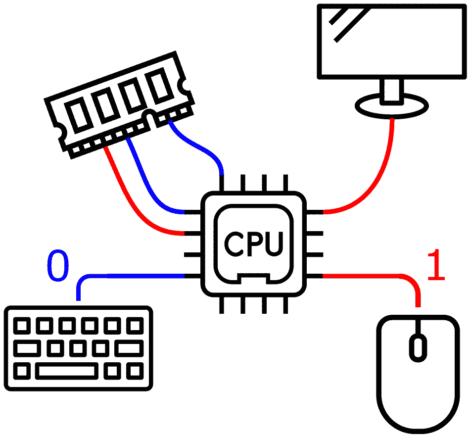
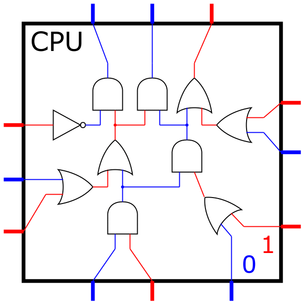
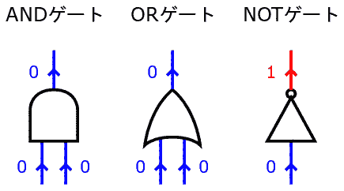
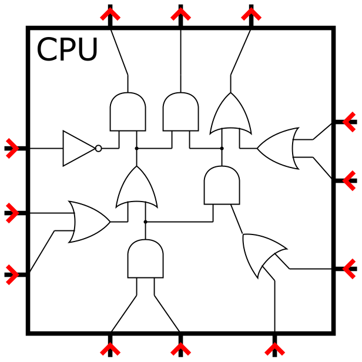
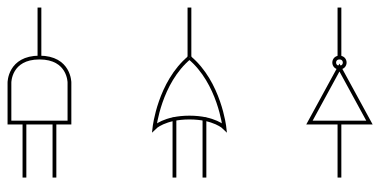
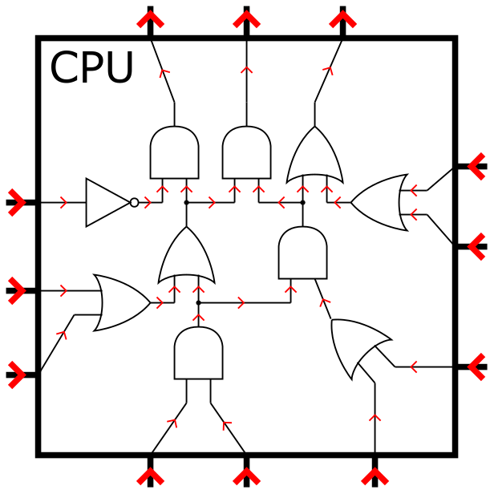

これは[物理アドベントカレンダー2021](https://qiita.com/advent-calendar/2021/physics)の12/18の記事ですが、書き進めるうちに物理とほぼ無関係になりました。
そのうえ途中で宣伝が入ります。

さてコンピュータと言えば

**「あなたはまるでコンピュータだわ。0と1で考える機械人間なのよ」**

という罵声に象徴されるように、本質は0と1、という思想が大流行しています。
これにイチャモンを付ける記事なわけですが、まず前提を知るために、定番の「コンピュータのしくみ」のお話をします。

# コンピュータの、よくある説明

雑に描くと、電子回路としてのコンピュータは以下のような感じです[^io-cpu-direct-connect]。

[^io-cpu-direct-connect]:わかりやすさを優先するため、キーボードやディスプレイをCPUに直結した回路図を描いた。実際のコンピュータではCPUの前段に様々なモジュールが挟まる。

CPUに様々なデバイスが繋がっています。
青(0)と赤(1)がチカチカしていますが、これは電気信号を表しています。
人がキーボードを叩くと、0や1の信号がCPUに届き、情報が処理され、そして0と1の信号がディスプレイに送られるわけです。

処理の中心はCPUですが、これは

* 0や1が入力され
* それを加工し
* 0や1を出力する

という活動をひたすら繰り返す装置といえます。

次にCPUの中身の回路図を見てみます。
本物のCPUは複雑なので簡略化して描くと

CPUの内部でも青(0)と赤(1)がチカチカしています。
目を凝らすと、CPUは3つの部品で作られていることが分かります。

これらは0や1が入力されると、それを加工して0や1を再出力するもので、論理ゲートと呼ばれています。
これをレゴのようにたくさん繋いで、大きなCPUが作られています。

とまぁ、ここまで読んだ方は
「コンピュータやCPUは0と1で動いてるんだなぁ」
と感じたことでしょう。
その感覚は完全に正しいです。

# なぜ0と1を使うのか？

今まで「0と1が～」みたいな話をしてきましたが、そもそもなぜ0と1を使うのでしょうか？
答えとしては

* 回路がシンプルで作りやすいから
* 途中で値が0.1や0.9のようにズレても、元の0や1に補正しやすいから

等の理由が挙げられるのですが、しかし実は

* **0と1でないとコンピュータが作れないから**

**という理由はありません。0と1でなくても、コンピュータは作れます。**

例えば [ソ連のSetunというコンピュータ](https://en.wikipedia.org/wiki/Setun) は 0,1,2 という三つの値で動いていました。
他にも様々な方式が提案されています。
詳しく知りたい方は「多値論理・コンピュータ」でweb検索すると良いでしょう。

# コンピュータの本質とは何か？

さてここからが本題です。

コンピュータは、普通の物体とは明らかに異なる、不思議な動きをするモノだと思うのですが、あの不思議さの源泉って何なのでしょう？
要するにコンピュータの本質って何ですか？という質問です。
答えは人によって違うと思いますが、しかし私としては

🤔「コンピュータの本質は0と1だ」

という意見にはノーと言いたくなります[^quantize]。
0と1でなくてもコンピュータは作れるわけで、そんな制約をコンピュータの本質として尊ぶのは、歪んだ思想に見えて仕方ありません。
もっと重大な

[^quantize]:ちなみに「ワイヤーの信号が離散値化されている」という性質はまぁまぁ本質的だと思うが、しかしそれより矢印の方が重要だと思う。まぁこのあたりの優先順位は答えが定まるものでは無いだろう。

😱「xxxxという制約が無いと、コンピュータという概念自体が崩壊する！」

みたいな制約は無いのでしょうか。
ここで、さっき説明したCPUの動作を思い出して下さい。

* 0や1が**入力**され
* それを加工し
* 0や1を**出力**する

つまりこの

**「入力と出力こそが、本質だ」**

というのが、本日のメインテーマです。

# 入出力の矢印

CPUの入力と出力を図示してみます。

赤の矢印で入出力を表現しました。
もちろんキーボードは入力線に、ディスプレイは出力線に繋げます。

ところでCPU内の論理ゲートにも入出力がありました。

この矢印をCPU本体に描き入れると

CPU内部の**全ワイヤーに矢印**が描かれました。
これは強烈な制約です。
実は1と0の他に、こんな制約が潜んでいたのです。
二つの制約を比較すると

* 全ワイヤーが`0`か`1`の値を持つ
* 全ワイヤーが`→`か`←`の向きを持つ

どちらもワイヤーに対する2値性を要求しており、制約の厳しさは同レベルと考えて良いでしょう。
そしてこの矢印の存在は、決して自明ではありません。

|              |矢印があるか？|
|:-------------|:-------------|
|コンピュータ  |ある          |
|普通の電気回路|ない          |

小中学校の理科を思い出してほしいのですが、回路図に矢印を描いた記憶はありますか？
ないですよね。
普通の回路には矢印なんて無いのです。
もしかすると「電流の向きを矢印で描いた記憶が...」と思ったかもしれません。
しかし現在普及しているコンピュータの矢印は、電流とは関係ないものです[^relay]。
この矢印はコンピュータに特有なのです。

[^relay]:リレー式のコンピュータにおける矢印の正体は、おおむね電流の向きと考えて良い。本当はこうした矢印の実装をアドベントカレンダーで詳述したかったのだが、その前提の話題で分量が逼迫したので、割愛した。

# 矢印があると何が嬉しいの？

矢印のメリットは、信号の追跡が簡単になることです。

* まず外部から入力信号が来て
* それが論理ゲートAで加工されて
* さらに論理ゲートBで加工されて
* さらに論理ゲートCで加工されて
* 出力信号として外部に送られる

みたいな感じで情報の流れが追えます。
プログラミングに例えると、関数を呼び出して、引数を渡し、返値を受け取り、それを別の関数に渡し、、、をやる感覚で、情報の流れが追跡できるのです。
雑にまとめると

**「回路の全ワイヤーに矢印が定まっている」**

という制約のおかげで

**「回路にプログラミング風の世界が宿る」**

のです。

ピンとこなければ、矢印を持たない普通の電気回路を考えて下さい。
小中学校の豆電球の回路や、高校物理のLC回路を思い出すと、「値を受け取って別の関数に渡す」みたいな雰囲気ではなかったですよね。
解き方としては、閉ループに対するキルヒホッフ則と、各点での電荷保存則を連立させて、電流と電圧を求めていました。
矢印が存在しないので、値を渡す/受け取る、みたいな話にならなかったのです。

この矢印の存在に比べると、「値が0と1」なんて些末な話だと思いませんか？
「信号の種類は0と1か？あるいは0と1と2か？」というのはプリミティブ変数の型に過ぎません。
どちらの方式でもコンピュータが作れるのは、その背後に宿る矢印が、回路全体を統括しているからなのです。

# 矢印を核として説明すべき

そんなこんなで、コンピュータの回路を説明する際には、矢印を中心に話を進めるべきだと私は思いました。
ところが「論理回路の基礎」とか「計算機アーキテクチャ」みたいな教科書を開くと、ひたすら0と1の話ばかり載ってて、矢印を詳述している本は見当たりません[^many-books]。
「この矢印は、物理的にはxxxxに対応する」みたいな説明が皆無なのです。

[^many-books]:和書だけでも膨大な量の解説書が出版されており、洋書まで含めるとチェックしきれなかった。

なぜだ。
おかしいじゃないか。
みんなもっと矢印の話をすべきだ。
そういう本が存在しないなら、もう、俺が書くしかないではないか。
そんな思いを込めて書いたのが、以下の拙著です[^is-this-ok]。

[^is-this-ok]:アドベントカレンダーに自著の紹介を載せて良いのか、Qiitaのレギュレーションを読んでもよく分からなかったのだが、しかし企業アカウントもあるので大丈夫だろう。たぶん。

<iframe style="width:120px;height:240px;" marginwidth="0" marginheight="0" scrolling="no" frameborder="0" src="https://rcm-fe.amazon-adsystem.com/e/cm?ref=qf_sp_asin_til&t=tukuroucpu-22&m=amazon&o=9&p=8&l=as1&IS1=1&detail=1&asins=4839968519&linkId=916b3d5ce6ebc0319c4f6521d8aeff8b&bc1=ffffff&lt1=_top&fc1=333333&lc1=0066c0&bg1=ffffff&f=ifr"></iframe>

最初の100ページでは矢印を使って論理回路の理解を深めます。
残りの100ページでは簡単なCPUを設計し、FPGAで動かします。
目的は後半のCPUの設計ですが、そのためには矢印の理解が必須(だと私は思う)ので、約半分のページを基礎パートに費やしています。

あ、そういえば「矢印の正体は結局何なのか？」という話をしていませんでした。
実は [拙著24ページ](https://book.mynavi.jp/files/topics/116654_ext_90_0.pdf#page=24) の右図[^book-color]が、この矢印の正体です。
電流との違いが一目瞭然ですね。
といっても、この図だけで矢印のココロを理解するのは無理なので、わざわざ100ページもかけて説明しているわけですが。

[^book-color]:色覚異常者の方に読みにくい配色で出版してしまったので、色違いバージョンのPDFを提供しています。ご不便をおかけします。<https://book.mynavi.jp/pcbook/blog/detail/id=119121>

# なぜ0と1が重視されているのか

以下は完全に蛇足なので、暇人以外はページを閉じてOKです。

巷では0と1による説明(つまりブール代数を重視する説明)が大流行しているのですが、これは一体なぜでしょう？
私の独断と偏見によると、ポイントは大きく3つあります。

### 歴史の流れ

まず歴史の視点です。
1935-1940年頃に、中嶋章氏とクロード・シャノン氏という2人の天才が、それぞれ独立に、今日に至るコンピュータ技術の基礎を建設しました[^history]。
いわゆる「スイッチング理論」と呼ばれるものです。
雑に要約すると、スイッチのみで作られている電子回路内の2地点が、繋がっているか？絶縁しているか？を扱う理論です。
この二択を記述する上で、ブール代数が便利だと中嶋氏は気づきました。
一方シャノン氏は回路上にブール代数を実装するという目的で、スイッチング理論を考案したようです。

[^history]:スイッチング理論の発見史については、この資料が大変詳しい。 <https://www.jstage.jst.go.jp/article/essfr/3/4/3_4_4_9/_pdf>

結果としてスイッチング理論が大成功し、何やかんやあった末に、今日のコンピュータになりました。
純粋数学に過ぎなかったブール代数が、まさかの工学的応用を経て、大成功をおさめたわけです。
そうした経緯により「コンピュータの基礎=ブール代数」という風潮が形成されたようです。

### ブール代数の重要性

別の視点としては、ブール代数自体の重要性が挙げられます。
論理回路とは無関係の話として、ブール代数は習得すべき知識です。
プログラミングや数学などで幅広く役立つ(というか必須)なので、情報科学の学習カリキュラム的に、どこかにねじ込む必要があります。
となると論理回路の講義に入れてるのが安牌なのかなと思います。
実際、身の回りのコンピュータは0と1で動いているので、回路の動作を理解する上でブール代数は大いに役立ちます。
まぁその前に矢印の話をすべきだと思いますが。

### 話題性

最後はキャッチコピーの視点です[^catch-copy]。
「0と1」という言葉は、大変キャッチーで、心を刺激し、人々をギョッとさせます。
冒頭の「あなたは0と1で考える機械人間なのよ」というセリフでは、0と1の響きが効いていますね。
いかにもキカイって感じです。
一方で「系の本質はグラフ構造の有向性である」とか言われても、なんかいまいち、グッとこないわけです。
0と1にはマーケティング上の絶大な利があります。ゆえに「矢印が本質だ」みたいな言説がメインストリームを占める日は当分来ないでしょう。

[^catch-copy]:正直これがめっちゃ効いてる気がする。

# なんでこんな文章を書いたのか

本当は物理アドベントカレンダーとして、様々な計算機アーキテクチャにおける「矢印の物理実装」を概観する予定でした。
CMOS回路・リレー回路・マリオメーカー・マインクラフト等で作られた論理回路を、矢印を中心に眺める予定だったのです。
ところが書き進めるうちに、「そもそもなぜ矢印を重視するのか？」というモチベーションを語らないと話にならないという認識に達し、こういう記事になってしまいました。
物理っぽい話はまた別の機会に。。。

# 脚注
